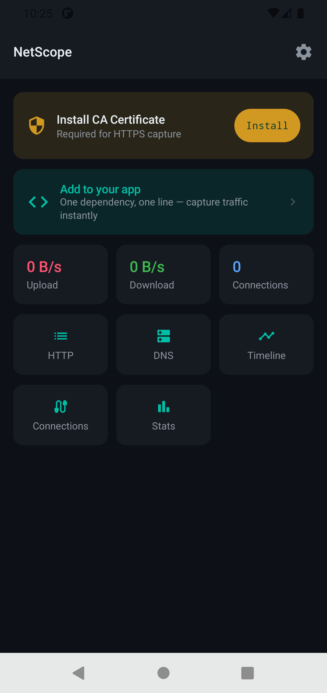
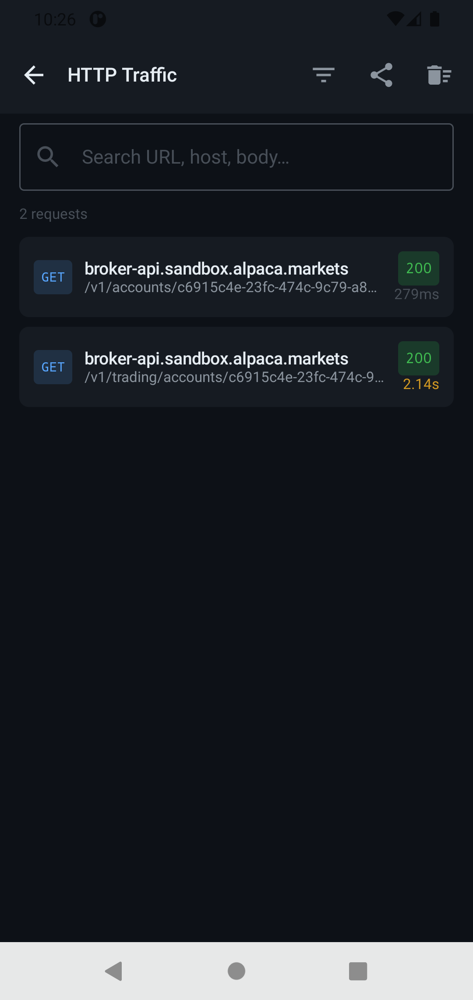
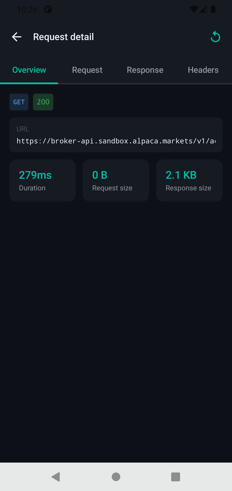
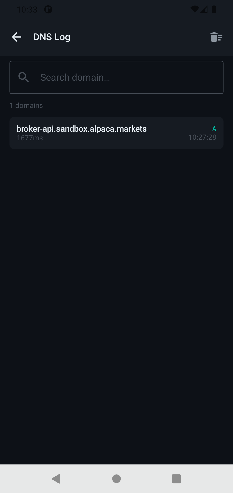
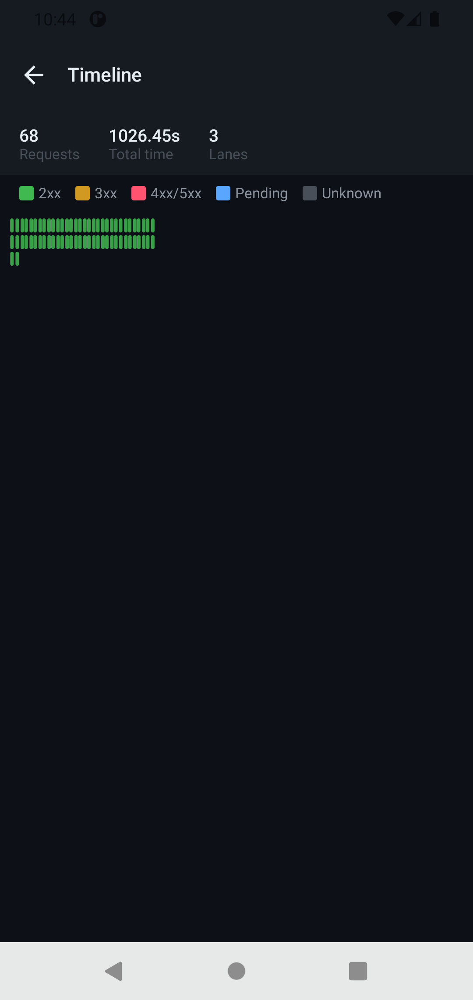

# NetScope

<p align="center">
  
</p>

<p align="center">
  <strong>A professional Android network inspector for developers — capture, inspect and replay HTTP/HTTPS traffic from your app in real time.</strong>
</p>

<p align="center">
  <a href="https://android-arsenal.com/api?level=26">
    
  </a>
  <a href="https://kotlinlang.org">
    
  </a>
  <a href="https://developer.android.com/jetpack/compose">
    
  </a>
  <a href="LICENSE">
    
  </a>
  <a href="https://jitpack.io/#netscope/netscope">
    
  </a>
</p>

---

## What is NetScope?

NetScope is a two-part developer tool for Android:

**The app** — installed on your device. Shows every HTTP/HTTPS request your app makes in real time. Full request and response bodies, headers, status codes, timing, DNS log, connection tracker, timeline waterfall, statistics, and HAR export.

**The interceptor library** — a single Gradle dependency you add to your app. One line in your `OkHttpClient`. Every request your app makes is captured and sent to the NetScope app on the same device.

Think **Chucker** meets **Charles Proxy** — but built entirely in Kotlin with a modern Compose UI, and designed as a proper developer tool rather than a debug overlay.

---

## Screenshots

<p align="center">
  
  
  
  
  
</p>

---

## How it works

```
Your app makes a network request
        ↓
NetScopeInterceptor intercepts it inside OkHttp
(before encryption — full plaintext access)
        ↓
Interceptor sends data to NetScope via ContentProvider
(cross-process, no broadcast, reliable)
        ↓
NetScope saves to Room database
        ↓
All screens update live via Kotlin Flow
        ↓
Works on WiFi AND mobile data — no proxy setup needed
```

The interceptor runs inside your app's process, before OkHttp encrypts anything. This means it can read full HTTPS request and response bodies without any certificate installation or proxy configuration. Your app's networking is completely unaffected — same requests, same responses, same performance.

---

## Quick start

### Step 1 — Install NetScope on your device

Download and install the NetScope APK on your Android device or emulator.

### Step 2 — Add the interceptor to your app

In your app's `build.gradle.kts`:

```kotlin
dependencies {
    debugImplementation("com.github.god-s-only:NetScope:v1.0.0")
}
```

In your `settings.gradle.kts`:

```kotlin
dependencyResolutionManagement {
    repositories {
        maven { url = uri("https://jitpack.io") }
    }
}
```

### Step 3 — Add to your OkHttpClient

```kotlin
val client = OkHttpClient.Builder()
    .addInterceptor(NetScopeInterceptor(context))
    .build()
```

### Step 4 — Trust user certificates for HTTPS capture (optional)

To capture HTTPS response bodies, add this to your debug app:

**`res/xml/network_security_config.xml`**

```xml
<?xml version="1.0" encoding="utf-8"?>
<network-security-config>
    <debug-overrides>
        <trust-anchors>
            <certificates src="system" />
            <certificates src="user" />
        </trust-anchors>
    </debug-overrides>
    <base-config cleartextTrafficPermitted="false">
        <trust-anchors>
            <certificates src="system" />
        </trust-anchors>
    </base-config>
</network-security-config>
```

**`AndroidManifest.xml`**

```xml
<application
    android:networkSecurityConfig="@xml/network_security_config"
    ...>
```

Then install the NetScope CA certificate once:
open NetScope → tap the certificate banner → follow the system prompt.

That is it. Run your app, make any network request, and watch it appear live in NetScope.

---

## Features

### HTTP Traffic List
- Live list of all captured requests updating in real time
- Full request — URL, method, headers, body
- Full response — status code, headers, body, timing
- Search by URL, host, path, or response body
- Filter by method (GET, POST, PUT, DELETE, PATCH)
- Filter by status category (2xx, 3xx, 4xx, 5xx)
- Filter by response time (> 500ms, > 1s, > 2s)
- Errors only and slow requests presets
- Active filter chips with badge count

### Request Detail
- Four-tab layout — Overview, Request, Response, Headers
- Full monospace body rendering
- One-tap replay shortcut

### Request Replay
- Resend any captured request directly in the app
- Edit URL, headers, and body before sending
- Response shown inline
- Replayed requests tagged separately

### DNS Log
- Every domain queried by your app via the Host header
- Search by domain
- Response time per entry
- Deduplicated per domain

### Connections Tracker
- Every unique host and port your app connected to
- Bytes sent and received per connection
- All connections and flagged tabs

### Timeline Waterfall
- Gantt-style chart of all requests plotted over time
- Concurrent requests shown in parallel swim lanes
- Color coded by status category
- Tap any bar to open the full request detail

### Statistics
- Total requests, unique hosts, DNS domains, connections
- Total bytes sent and received
- Error rate with color coding
- Average, fastest, and slowest response times
- Most active host and most used method

### Export to HAR
- HAR 1.2 format — opens in Chrome DevTools, Postman, Charles Proxy
- Full headers, bodies, and timing included
- Share via any installed app

### Settings
- Max stored requests with auto-clear enforcement
- Show replayed requests toggle
- Clear all data with confirmation
- App version info

---

## Project structure

NetScope is a two-module Android project:

```
NetScope/
├── app/                              # The NetScope Android app
│   └── src/main/
│       ├── data/
│       │   ├── local/                # Room database, DAOs, entities, mappers
│       │   ├── provider/
│       │   │   └── NetScopeTransactionProvider  # Receives data from interceptor
│       │   ├── proxy/
│       │   │   ├── cert/             # CA + per-host certificate generation
│       │   │   └── HttpTransactionEmitter       # SharedFlow broadcast hub
│       │   └── repository/           # Repository implementations
│       ├── di/                       # Hilt modules
│       ├── domain/
│       │   ├── model/                # Pure Kotlin data models
│       │   ├── repository/           # Repository interfaces
│       │   └── usecase/              # Use cases
│       └── presentation/
│           ├── screens/
│           │   ├── dashboard/        # Dashboard + ViewModel
│           │   ├── detail/           # Request detail + ViewModel
│           │   ├── dns/              # DNS log + ViewModel
│           │   ├── connections/      # Connections + ViewModel
│           │   ├── integration/      # Integration guide screen
│           │   ├── onboarding/       # Onboarding + ViewModel
│           │   ├── replay/           # Replay + ViewModel
│           │   ├── settings/         # Settings + ViewModel
│           │   ├── stats/            # Statistics + ViewModel
│           │   ├── timeline/         # Timeline + ViewModel
│           │   └── traffic/          # Traffic list + ViewModel
│           ├── components/           # Shared Composables
│           ├── navigation/           # NavGraph, NavRoutes, NavArgs
│           └── theme/                # Color, Type, Theme
│
└── interceptor/                      # The publishable library module
    └── src/main/
        ├── NetScopeInterceptor.kt    # OkHttp interceptor — the only file devs use
        ├── NetScopeContract.kt       # ContentProvider URI and column constants
        └── NetScopeProvider.kt       # Stub provider for manifest merger
```

### Architecture

```
NetScopeInterceptor (in developer's app)
        ↓  ContentProvider insert()
NetScopeTransactionProvider (in NetScope app)
        ↓  emitter.emit()
HttpTransactionEmitter (SharedFlow)
        ↓
┌─────────────────────────────────────┐
│  TrafficRepositoryImpl  → Room      │
│  DnsRepositoryImpl      → Room      │
│  ConnectionRepositoryImpl → Room    │
│  BandwidthRepositoryImpl → StateFlow│
└─────────────────────────────────────┘
        ↓  Flow
Use Cases → ViewModels → Compose screens
```

---

## Tech Stack

### Language and core
| Technology | Purpose |
|---|---|
| **Kotlin 1.9.22** | 100% Kotlin — no Java |
| **Kotlin Coroutines** | All async operations |
| **Kotlin Flow** | Live data streams throughout |
| **KSP** | Symbol processing — faster builds than KAPT |

### Architecture
| Pattern | Implementation |
|---|---|
| **Clean Architecture** | Strict Data / Domain / Presentation separation |
| **MVVM** | ViewModels expose `StateFlow<UiState>` to screens |
| **Repository pattern** | Domain depends only on interfaces |
| **Use cases** | Single responsibility, one `operator fun invoke()` |
| **Single Activity** | Compose Navigation throughout |

### UI
| Technology | Purpose |
|---|---|
| **Jetpack Compose** | 100% declarative UI — no XML layouts |
| **Material 3** | Design system, theming, components |
| **Navigation Compose** | Type-safe navigation with SavedStateHandle |
| **Compose Canvas** | Custom Gantt timeline chart |
| **Core SplashScreen** | Branded splash screen |
| **Material Icons Extended** | Icons throughout |

### Dependency injection
| Technology | Purpose |
|---|---|
| **Hilt** | Compile-time DI — `@HiltAndroidApp`, `@HiltViewModel` |

### Database and storage
| Technology | Purpose |
|---|---|
| **Room** | SQLite persistence — transactions, DNS, connections |
| **Room Flow DAOs** | Live database queries |
| **TypeConverters** | Maps, lists, enums via Gson |
| **DataStore Preferences** | Settings persistence |

### Inter-process communication
| Technology | Purpose |
|---|---|
| **ContentProvider** | Receives `HttpTransaction` data from interceptor in target app |
| **Hilt EntryPoint** | Accesses Hilt graph from ContentProvider |

### Networking
| Technology | Purpose |
|---|---|
| **OkHttp 4** | Interceptor API + replay |
| **Retrofit 2** | Available for future integrations |
| **BouncyCastle** | CA certificate generation for HTTPS capture |
| **Conscrypt** | Modern TLS provider |

### Export
| Technology | Purpose |
|---|---|
| **HAR 1.2** | Industry standard traffic export |
| **Gson** | JSON serialization |
| **FileProvider** | Secure file sharing |

---

## Interceptor library

The `interceptor` module is a standalone Android library with zero dependencies beyond OkHttp and Gson. It is designed to be added to any existing Android app without any architectural changes.

### What it does

Implements `okhttp3.Interceptor`. On every request it:

1. Reads the request body using `Buffer` without consuming it
2. Proceeds with the request normally
3. Reads the response body using `peekBody()` without consuming it
4. Handles gzip decompression if `Content-Encoding: gzip`
5. Sends all captured data to the NetScope app via `ContentResolver.insert()`
6. Returns the original response to the caller — completely unmodified

The host app never knows the interceptor is there. Performance impact is negligible.

### Publishing via JitPack

Push to GitHub. JitPack builds the library automatically on the first request.

Users add:

```kotlin
// settings.gradle.kts
repositories {
    maven { url = uri("https://jitpack.io") }
}

// build.gradle.kts
debugImplementation("com.github.YOUR_USERNAME:NetScope:TAG")
```

### Publishing to Maven Central

```bash
./gradlew :interceptor:publishToMavenLocal   # local testing
./gradlew :interceptor:publish               # Maven Central (requires Sonatype setup)
```

---

## Permissions

| Permission | Why |
|---|---|
| `INTERNET` | Replay requests and forward traffic |
| `ACCESS_NETWORK_STATE` | Network availability checks |

The interceptor library requires no additional permissions. It only calls `context.contentResolver.insert()` which is a standard Android API.

---

## Privacy

- No data leaves your device. NetScope makes no outbound connections of its own.
- All captured traffic is stored in a local Room database private to the app.
- Clear all data at any time from Settings or individual screens.
- The CA certificate is generated fresh per device install.
- Always use `debugImplementation` — never ship the interceptor in a production build.

---

## Building a release APK

```bash
./gradlew assembleRelease
```

Create `keystore.properties` at the project root:

```properties
storeFile=../keystore/netscope.keystore
storePassword=your_store_password
keyAlias=netscope
keyPassword=your_key_password
```

Reference in `app/build.gradle.kts`:

```kotlin
android {
    signingConfigs {
        create("release") {
            val props = Properties().apply {
                load(rootProject.file("keystore.properties").inputStream())
            }
            storeFile = file(props["storeFile"] as String)
            storePassword = props["storePassword"] as String
            keyAlias = props["keyAlias"] as String
            keyPassword = props["keyPassword"] as String
        }
    }
    buildTypes {
        release {
            signingConfig = signingConfigs.getByName("release")
            isMinifyEnabled = true
            proguardFiles(
                getDefaultProguardFile("proguard-android-optimize.txt"),
                "proguard-rules.pro"
            )
        }
    }
}
```

---

## Contributing

1. Fork the repository
2. Create a feature branch: `git checkout -b feat/your-feature`
3. Commit using conventional commits: `feat:`, `fix:`, `chore:`, `refactor:`
4. Open a pull request with a clear description

### Code style
- All features go through the domain layer — ViewModels never call repositories directly
- Use cases are single-responsibility with one `operator fun invoke()`
- All Room queries return `Flow`
- New screens require a `UiState` data class and `BaseViewModel` subclass
- Standard Kotlin formatting — no aligned equals signs

---

## License

```
Copyright 2024 NetScope

Licensed under the Apache License, Version 2.0 (the "License");
you may not use this file except in compliance with the License.
You may obtain a copy of the License at

    http://www.apache.org/licenses/LICENSE-2.0

Unless required by applicable law or agreed to in writing, software
distributed under the License is distributed on an "AS IS" BASIS,
WITHOUT WARRANTIES OR CONDITIONS OF ANY KIND, either express or implied.
See the License for the specific language governing permissions and
limitations under the License.
```

---

## Acknowledgements

- [OkHttp](https://square.github.io/okhttp/) — interceptor API
- [Chucker](https://github.com/ChuckerTeam/chucker) — inspiration for the interceptor approach
- [Retrofit](https://square.github.io/retrofit/) — HTTP client
- [Hilt](https://dagger.dev/hilt/) — dependency injection
- [Room](https://developer.android.com/jetpack/androidx/releases/room) — database
- [Jetpack Compose](https://developer.android.com/jetpack/compose) — UI toolkit
- [BouncyCastle](https://www.bouncycastle.org/) — certificate generation
- [Conscrypt](https://github.com/google/conscrypt) — TLS provider

---

<p align="center">
  Built for Android developers who want to know exactly what their app is doing on the network.
</p>
